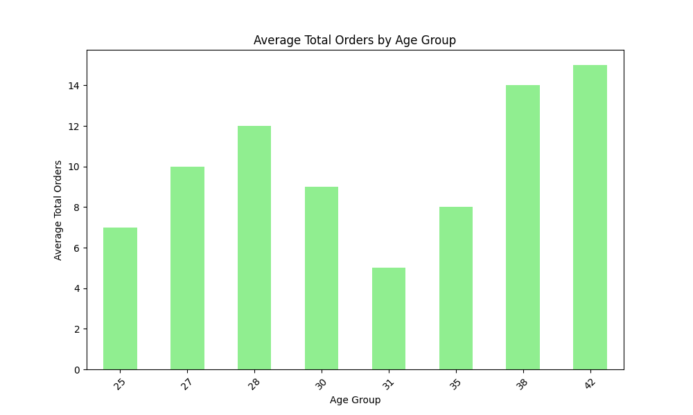

# User Behavior Analysis Project

## 1. Introduction

This project aims to analyze user behavior, cooking preferences, and order trends using three datasets: User Details, Cooking Sessions, and Order Details. The objective is to uncover insights that can help improve user engagement and increase sales through targeted marketing strategies and product offerings.

## 2. Data Overview

### User Details
- **User  ID**: Unique identifier for each user (object).
- **User  Name**: Name of the user (object).
- **Age**: Age of the user (int64).
- **Location**: Geographic location of the user (object).
- **Registration Date**: Date when the user registered (datetime).
- **Phone**: User's phone number (object).
- **Email**: User's email address (object).
- **Favorite Meal**: User's favorite meal (object).
- **Total Orders**: Total number of orders placed by the user (int64).

### Cooking Sessions
- **Session ID**: Unique identifier for each cooking session (object).
- **User  ID**: Unique identifier for the user participating in the session (object).
- **Dish Name**: Name of the dish cooked during the session (object).
- **Meal Type**: Type of meal (e.g., breakfast, lunch, dinner) (object).
- **Session Start**: Start time of the cooking session (datetime).
- **Session End**: End time of the cooking session (datetime).
- **Duration (mins)**: Duration of the cooking session in minutes (int64).
- **Session Rating**: User rating for the cooking session (float64).

### Order Details
- **Order ID**: Unique identifier for each order (int64).
- **User  ID**: Unique identifier for the user who placed the order (object).
- **Order Date**: Date when the order was placed (datetime).
- **Meal Type**: Type of meal ordered (object).
- **Dish Name**: Name of the dish ordered (object).
- **Order Status**: Status of the order (e.g., completed, pending) (object).
- **Amount (USD)**: Total amount of the order in USD (float64).
- **Time of Day**: Time when the order was placed (object).
- **Rating**: User rating for the order (float64, nullable).
- **Session ID**: Unique identifier for the cooking session associated with the order (object).

## 3. Data Cleaning and Preparation

During the data cleaning process, the following steps were taken:
- **Handling Missing Values**: Checked for and addressed any missing values in the datasets.
- **Merging Datasets**: Combined the three datasets based on the `User  ID` and `Session ID` to create a comprehensive view of user behavior.
- **Creating New Columns**: Created an `age_group` column based on the `Age` column to facilitate demographic analysis.

## 4. Data Analysis and Visualization

### 4.1 Correlation Analysis
The correlation analysis revealed a positive correlation between cooking session duration and total orders. This suggests that users who spend more time cooking tend to place more orders.

### 4.2 Popular Dishes
The analysis identified the top 10 popular dishes based on order frequency. These dishes are crucial for targeted marketing efforts.

### 4.3 Demographic Analysis
The average total orders by age group were analyzed, revealing trends in ordering behavior across different age demographics.

## 5. Key Insights

- **Relationship Between Cooking Sessions and Orders**: Users who engage in more cooking sessions tend to place more orders.
- **Popular Dishes**: Certain dishes are significantly more popular, indicating potential areas for promotional focus.
- **Demographic Influence**: Different age groups exhibit varying ordering behaviors, which can inform targeted marketing strategies.

## 6. Business Recommendations

Based on the findings, the following recommendations are proposed:
- **Target Specific Age Groups**: Develop tailored marketing strategies aimed at specific age demographics to increase engagement.
- **Promote Popular Dishes**: Highlight and promote the top 10 popular dishes to boost sales.
- **Encourage Cooking Sessions**: Implement initiatives to encourage users to participate in more cooking sessions, potentially increasing their order frequency.

## 7. Conclusion

In conclusion, this analysis provides valuable insights into user behavior, cooking preferences, and order trends. By leveraging these insights, the business can enhance user engagement 
